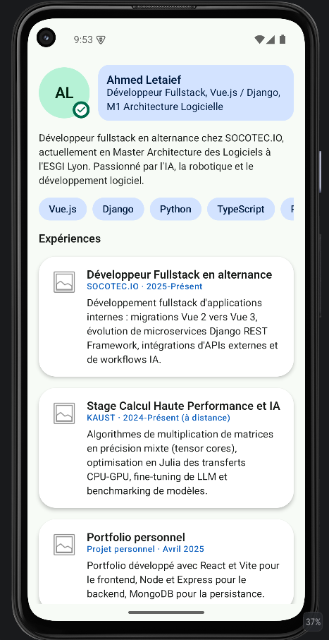
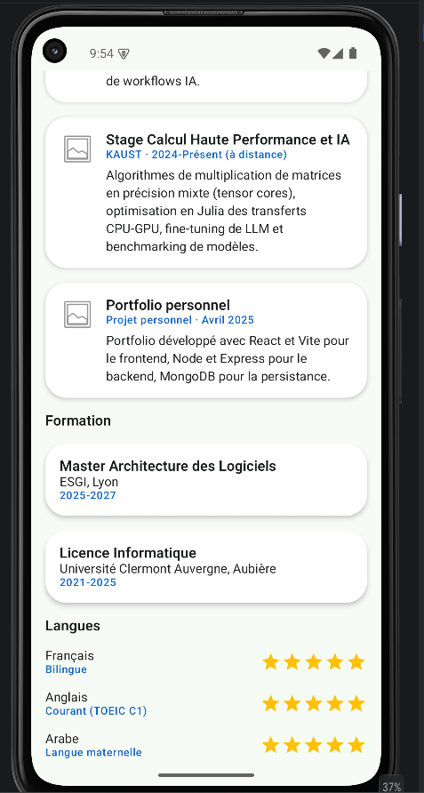
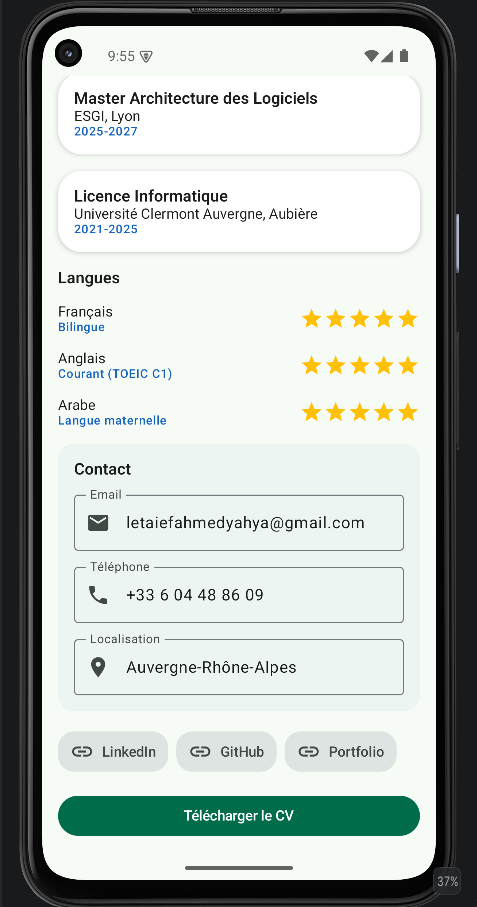

# Profil Développeur V2

C'est mon devoir d'amélioration de l'application « Profil développeur » que j'avais faite en
Jetpack Compose. Je suis reparti de mon premier projet,
[`Compose-Profil-Developpeur`](https://github.com/DARK-SHAD0W/Compose-Profil-Developpeur) (que je
n'ai pas touché, il garde sa propre note), et je l'ai fait évoluer dans un nouveau dépôt en
réutilisant tout ce qu'on a vu dans le chapitre Compose UI : composants fondamentaux, layouts,
listes modernes, cartes réutilisables, Material Design 3, thème clair/sombre.

Par défaut, l'écran affiche mon propre profil (Ahmed Yahya Letaief), avec des vraies infos tirées
de mon CV : mon poste chez SOCOTEC.IO, mon master à l'ESGI, mes compétences, mes expériences, mes
langues. J'ai aussi ajouté un deuxième profil, fictif celui-là, Irina Karlovna, pour vérifier que
mes composables marchent avec n'importe quelles données et pas seulement les miennes. Dans les deux
cas, tout reste local : pas d'appel réseau, pas de base de données, les données sont écrites
directement dans le code Kotlin.

## Les composants fondamentaux que j'ai utilisés

- `Text` pour les titres, descriptions et infos (nom, rôle, expériences, formations...)
- `Button` pour l'action principale, "Télécharger le CV"
- `Icon` sur les champs de contact, le badge de statut et les liens professionnels
- `Image` pour le petit logo placeholder sur chaque carte de projet/expérience
- `Card` pour chaque expérience (`ProjectCard`) et chaque formation (`FormationCard`)
- `OutlinedTextField` en lecture seule pour l'email, le téléphone et la localisation

## Les layouts

- `Column` pour structurer l'écran et chaque section verticalement
- `Row` pour aligner l'avatar avec mon identité (`EnTeteProfil`), et l'icône avec le libellé de
  chaque lien professionnel
- `Box` pour superposer le badge de statut sur l'avatar (`AvatarAvecBadge`)
- `Spacer` entre l'avatar et le bloc identité
- `Surface` pour les puces de compétences, le badge, la zone de contact et les liens

## Les listes modernes (LazyColumn / LazyRow)

Tout l'écran (`PageProfil`) est une seule `LazyColumn`. Je mélange des éléments uniques
(`item { ... }` pour l'en-tête, la description, les titres de section) avec des collections
(`items(...)` pour mes expériences, mes formations, mes langues). C'est le même principe que le
catalogue de produits qu'on avait fait avant : afficher un nombre d'éléments qu'on ne connaît pas
à l'avance, chacun avec une carte réutilisable plutôt qu'une `Column` figée.

J'ai ajouté deux `LazyRow` pour les collections horizontales : mes compétences
(`CompetencesSection`, une `CompetenceChip` par compétence) et mes liens professionnels
(`LiensProfessionnelsSection`, une `LienProfessionnelChip` par lien). Le format horizontal évite de
prendre trop de hauteur pour des éléments courts.

## Les langues, avec des étoiles

J'ai repris le principe de la note produit du TP4 (des `Icon` en étoile, jaunes) pour afficher le
niveau de chaque langue plutôt qu'un simple texte. Les miennes viennent de mon CV : français
bilingue, anglais courant (TOEIC C1), arabe langue maternelle, toutes à 5 étoiles. Le profil
d'Irina a un jeu de langues différent (russe, anglais, français) avec des niveaux différents, pour
vérifier que le composant s'adapte bien à n'importe quel niveau.

## Le thème

Mon thème (`ProfilDeveloppeurV2Theme`) personnalise les trois piliers de Material 3 :

- `ColorScheme` : palette claire et sombre, vert en couleur principale (repris du thème que j'avais
  fait au TP7 sur Product Explorer) et bleu standard en secondaire. J'ai défini explicitement tous
  les rôles utilisés dans l'appli, y compris les `Container` (`primaryContainer`,
  `secondaryContainer`) et `surfaceVariant`. Sans ça, Material 3 retombe sur sa palette rose par
  défaut dès qu'un composant utilise un rôle que je n'ai pas défini, ce qui m'a donné un rendu
  incohérent au début, surtout en thème sombre.
- `Shapes` : des coins arrondis personnalisés, utilisés entre autres sur les puces et le badge.
- `Typography` : des styles de texte personnalisés (`titleLarge`, `titleMedium`, `bodyMedium`,
  `labelLarge`, `labelMedium`) pour distinguer titres, textes et libellés.

J'ai fait quatre previews qui couvrent le thème clair et sombre pour mes deux profils, histoire de
vérifier que tout reste lisible dans les quatre cas.

## Mon avatar

Plutôt qu'une photo, mon avatar affiche mes initiales sur un cercle coloré (un peu comme sur Gmail
ou Slack). C'est généré directement à partir du prénom et du nom, ça marche pour n'importe quel
profil, et ça m'évite de devoir stocker une vraie photo dans le projet.

## Structure du projet

```
app/src/main/java/com/example/profildeveloppeurv2/
├── MainActivity.kt                     # Activity : thème + Scaffold
└── ui/
    ├── profil/
    │   ├── ProfilDeveloppeur.kt        # modèles de données + profilAhmed() / profilIrina()
    │   ├── PageProfil.kt               # écran principal, LazyColumn
    │   ├── EnTeteProfil.kt             # Row : avatar + identité
    │   ├── AvatarAvecBadge.kt          # Box : avatar en initiales + badge de statut
    │   ├── IdentiteDeveloppeur.kt      # nom + rôle
    │   ├── CompetencesSection.kt       # CompetenceChip + LazyRow
    │   ├── ProjectCard.kt              # carte réutilisable : expérience / projet
    │   ├── FormationCard.kt            # carte réutilisable : diplôme / formation
    │   ├── LangueItem.kt               # NotationEtoiles + niveau de langue
    │   ├── ZoneContact.kt              # OutlinedTextField en lecture seule
    │   ├── LiensProfessionnelsSection.kt   # LienProfessionnelChip + LazyRow
    │   ├── ActionPrincipale.kt         # bouton d'action principal
    │   └── PageProfilPreview.kt        # previews (2 profils x clair/sombre)
    └── theme/
        ├── Color.kt                   # palettes claire / sombre
        ├── Theme.kt                   # ColorScheme + Shapes personnalisées
        └── Type.kt                    # Typography personnalisée
```

## Mes captures d'écran

### L'écran complet, du haut vers le bas

Mon contenu dépasse la hauteur d'un écran de téléphone, d'où la `LazyColumn`. Ces trois captures
mises bout à bout montrent mon écran du haut jusqu'en bas.

| Haut de l'écran | Milieu | Bas de l'écran |
|---|---|---|
|  |  |  |

### Deux profils différents

<p align="center">
  
  
</p>

Ce sont exactement les mêmes composables (`PageProfil`, `EnTeteProfil`, `ProjectCard`...) qui
affichent deux personnes complètement différentes. Je n'ai rien codé en dur : chaque composable
reçoit ses données en paramètre (`profil: ProfilDeveloppeur`, `experience: ExperienceProjet`...),
donc changer `profilAhmed()` en `profilIrina()` dans `MainActivity` suffit à obtenir un tout autre
écran, sans toucher à un seul composable.

### Thème clair et thème sombre

<p align="center">
  
  
</p>

## Quelles notions du chapitre Compose UI ai-je réutilisées dans cette application ?

Un peu tout le chapitre, en fait. Les composants fondamentaux pour afficher chaque info avec le bon
niveau d'importance (un titre n'a pas le même poids qu'une description), les layouts pour
structurer l'écran au lieu d'empiler du texte brut, les listes modernes pour gérer un nombre
variable d'éléments avec des cartes réutilisables plutôt que des `Column` figées, et Material
Design 3 pour avoir une identité visuelle cohérente sans redessiner chaque composant à la main.

Ce qui a le plus changé par rapport à ma première version, c'est justement le thème. Dans l'ancienne
appli, je posais une couleur de fond différente sur chaque `Surface`, choisie à la main, sans lien
avec un système cohérent. Ici je passe par les rôles du thème (`primary`, `secondary`,
`background`, `surface`...), donc tout reste cohérent et s'adapte automatiquement au mode sombre
sans que j'aie besoin de retoucher un seul composant. Ça m'a aussi appris un truc que je ne savais
pas avant : si on utilise un rôle de couleur qu'on n'a pas défini soi-même (`primaryContainer`,
`surfaceVariant`...), Material 3 ne prévient pas, il retombe silencieusement sur sa palette rose
par défaut. Je suis tombé plusieurs fois sur ce problème en construisant cette version, et ça m'a
obligé à comprendre vraiment comment `ColorScheme` fonctionne plutôt que de me contenter de définir
`primary` et `secondary` et de considérer que c'était fini.

J'ai aussi réutilisé des idées d'autres TP dans ce devoir : la notation en étoiles jaunes vient de
`ProductRating` au TP4, la structure en `LazyColumn` avec `item`/`items` mélangés vient de l'écran
catalogue du TP6, et la façon de construire le thème (couleurs, formes, typographie séparées, deux
previews clair/sombre) vient directement du TP7. Le fait d'avoir deux profils différents
(`profilAhmed()` et `profilIrina()`) qui passent par les mêmes composables, c'est ce qui me
prouve le mieux que mes composants sont vraiment réutilisables et pas juste écrits pour un seul cas
précis.
