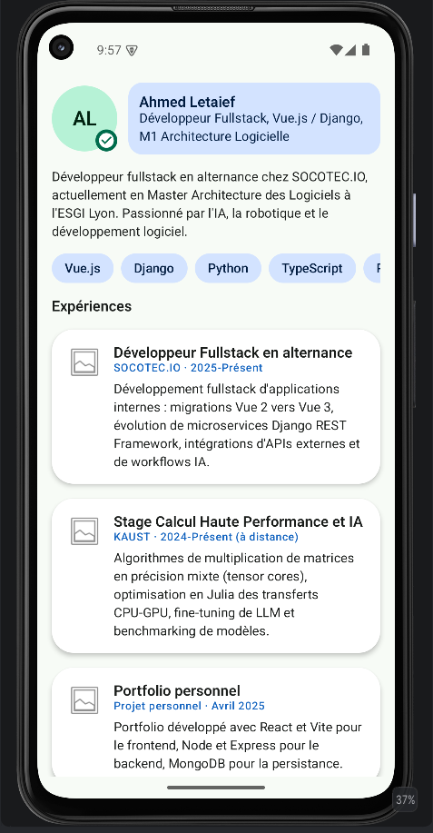
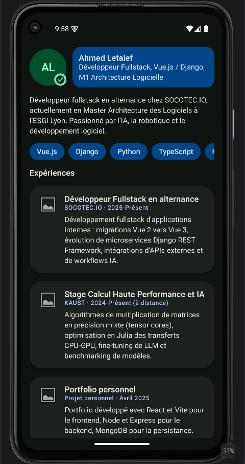
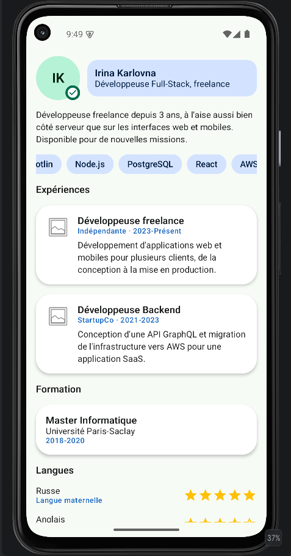

# Profil Développeur V2

Version améliorée de l'application « Profil développeur », construite avec Jetpack Compose. Ce
projet reprend et fait évoluer [`Compose-Profil-Developpeur`](https://github.com/DARK-SHAD0W/Compose-Profil-Developpeur)
(le premier devoir, laissé intact pour sa propre notation) dans un nouveau dépôt. L'objectif était
de réutiliser les notions du chapitre Compose UI : composants fondamentaux, layouts, listes
modernes, cartes réutilisables, Material Design 3 et thème clair/sombre.

Le profil affiché est celui d'Ahmed Yahya Letaief, développeur fullstack en alternance chez
SOCOTEC.IO et étudiant en Master Architecture des Logiciels à l'ESGI Lyon. Les données sont réelles
mais restent locales : pas d'appel réseau, pas de base de données, tout est écrit directement dans
le code Kotlin.

## Composants Compose fondamentaux

- `Text` : titres, descriptions, informations (nom, rôle, expériences, formations...)
- `Button` : action principale, "Télécharger le CV"
- `Icon` : champs de contact, badge de statut, liens professionnels
- `Image` : logo placeholder sur chaque carte de projet/expérience
- `Card` : une carte par expérience (`ProjectCard`) et par formation (`FormationCard`)
- `OutlinedTextField` en lecture seule : email, téléphone et localisation dans `ZoneContact`

## Layouts

- `Column` : structure verticale de l'écran et de chaque section
- `Row` : avatar + identité du développeur (`EnTeteProfil`), icône + libellé de chaque lien
- `Box` : superpose le badge de statut sur l'avatar (`AvatarAvecBadge`)
- `Spacer` : espace entre l'avatar et le bloc identité
- `Surface` : puces de compétences, badge de statut, zone de contact, liens professionnels

## Listes modernes (LazyColumn / LazyRow)

L'écran entier (`PageProfil`) est une seule `LazyColumn`. Elle mélange des éléments uniques
(`item { ... }` pour l'en-tête, la description, les titres de section) et des collections
(`items(...)` pour les expériences et les formations) : même logique qu'un catalogue de produits,
afficher un nombre variable d'éléments sans le connaître à l'avance, avec une carte réutilisable
par élément.

Deux `LazyRow` gèrent les collections horizontales : les compétences (`CompetencesSection`, une
`CompetenceChip` par compétence) et les liens professionnels (`LiensProfessionnelsSection`, une
`LienProfessionnelChip` par lien). Le format horizontal évite de prendre trop de hauteur pour des
éléments courts.

## Langues

Chaque langue est affichée avec son niveau sous forme d'étoiles (`NotationEtoiles`, `Icon` jaune,
même principe que la note produit du TP4). Les données viennent du CV : français bilingue, anglais
courant (TOEIC C1), arabe langue maternelle.

## Thème

Le thème (`ProfilDeveloppeurV2Theme`) personnalise les trois piliers de Material 3 :

- `ColorScheme` : palette claire et sombre, vert en couleur principale (repris du thème du TP7,
  Product Explorer) et bleu standard en secondaire. Tous les rôles utilisés dans l'app sont
  définis explicitement, y compris les `Container` (`primaryContainer`, `secondaryContainer`) et
  `surfaceVariant` : sans ça, Material 3 retombe sur sa palette rose par défaut dès qu'un
  composant utilise un rôle non défini, ce qui donnait un rendu incohérent, surtout en sombre.
- `Shapes` : coins arrondis personnalisés, utilisés entre autres par les puces et le badge.
- `Typography` : styles de texte personnalisés (`titleLarge`, `titleMedium`, `bodyMedium`,
  `labelLarge`, `labelMedium`) pour distinguer titres, textes et libellés.

Quatre previews couvrent thème clair/sombre pour les deux profils du projet (Ahmed et Irina), pour
vérifier que tout reste lisible dans les deux cas et avec des données différentes.

## Avatar

Plutôt qu'une photo, l'avatar affiche les initiales du développeur sur un cercle coloré (comme sur
Gmail ou Slack). C'est généré directement à partir du prénom et du nom, ça marche pour n'importe
quel profil, et ça évite de devoir stocker une vraie photo dans le projet.

## Structure du projet

```
app/src/main/java/com/example/profildeveloppeurv2/
├── MainActivity.kt                     # Activity : thème + Scaffold
└── ui/
    ├── profil/
    │   ├── ProfilDeveloppeur.kt        # modèles de données + profilAhmed() / profilIrina()
    │   ├── PageProfil.kt               # écran principal, LazyColumn
    │   ├── EnTeteProfil.kt             # Row : avatar + identité
    │   ├── AvatarAvecBadge.kt          # Box : avatar en initiales + badge de statut
    │   ├── IdentiteDeveloppeur.kt      # nom + rôle
    │   ├── CompetencesSection.kt       # CompetenceChip + LazyRow
    │   ├── ProjectCard.kt              # carte réutilisable : expérience / projet
    │   ├── FormationCard.kt            # carte réutilisable : diplôme / formation
    │   ├── LangueItem.kt               # NotationEtoiles + niveau de langue
    │   ├── ZoneContact.kt              # OutlinedTextField en lecture seule
    │   ├── LiensProfessionnelsSection.kt   # LienProfessionnelChip + LazyRow
    │   ├── ActionPrincipale.kt         # bouton d'action principal
    │   └── PageProfilPreview.kt        # previews (2 profils x clair/sombre)
    └── theme/
        ├── Color.kt                   # palettes claire / sombre
        ├── Theme.kt                   # ColorScheme + Shapes personnalisées
        └── Type.kt                    # Typography personnalisée
```

## Aperçu

Quatre captures, une par preview : les deux profils (Ahmed, Irina), chacun en thème clair et sombre.

### Ahmed

<p align="center">
  
  
</p>

### Irina

<p align="center">
  
  
</p>

## Quelles notions du chapitre Compose UI avez-vous réutilisées dans cette application ?

Un peu tout le chapitre. Les composants fondamentaux pour afficher chaque information avec le bon
niveau d'importance, les layouts pour structurer l'écran au lieu d'empiler du texte, les listes
modernes pour gérer un nombre variable d'éléments avec des cartes réutilisables plutôt que des
`Column` figées, et Material Design 3 pour avoir une identité visuelle cohérente sans redessiner
chaque composant à la main.

Ce dernier point est ce qui a le plus changé par rapport à la première version. L'ancienne
application posait une couleur de fond différente sur chaque `Surface`, choisie à la main. Celle-ci
passe par les rôles du thème (`primary`, `secondary`, `background`, `surface`...), donc tout reste
cohérent et s'adapte automatiquement au mode sombre sans rien retoucher.
